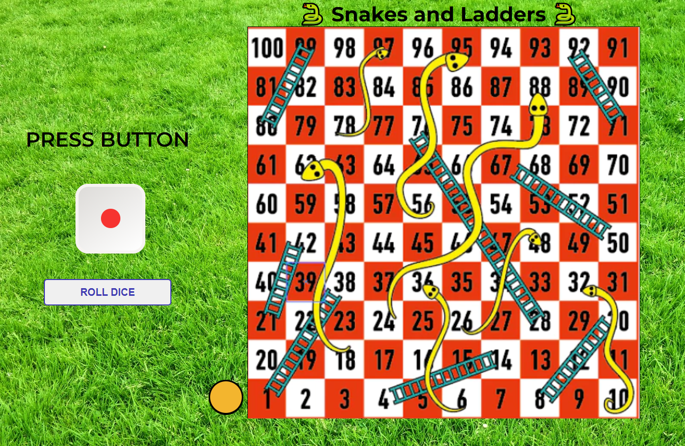

# Snakes and Ladders

A JavaScript computer game I built to further develop my knowledge and skills.

## What is Snakes and Ladders?

Play the classic Snakes and Ladders board game, but now adapted for the computer screen. This two person game is red versus yellow. Click the 'Roll Dice' button to generate a random number between 1 to 6 to determine how many squares your piece moves. Land on a square containing the end of the ladder and advance to the top of the ladder. Land on a square with a snake head, and slide back down the board to the end of the ladder. Containing 100 board squares to advance across, be the first person to reason the final square to win.

## Built with

- HTML
- CSS
- JavaScript

## What I learned by building this project?

I learned how to dynamically render divs onto the page by using a for loop. The most difficult part about this for loop, was that I had to add a paragraph tab, with a class, tag to one specific div to create the board pieces. I ended up using ChatGPT to help me figure out the solution, which involved using an if statement and appendChild.

    Play the game <a href="https://ceceliabraswell.github.io/snakes-and-ladders/">here</a>!

